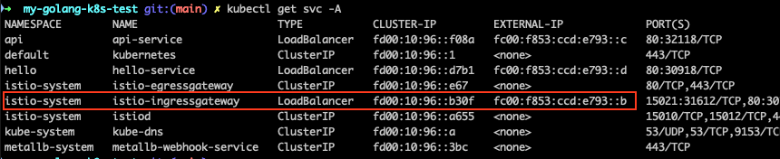

# My Golang K8s Test Project

## Overview
This project is a sample application using Golang and Kubernetes.

## Setup

### Prerequisites
- Go
- Kubernetes
- Helm
- istioctl
- kustomize

### Installation Steps

1. Install dependencies:

   ```
   go mod download
   ```

2. Set up MetalLB:

   ```
   helm repo add metallb https://metallb.github.io/metallb
   kubectl create namespace metallb-system
   helm install metallb metallb/metallb -n metallb-system
   ```
3. set up istio
   
   ```
   istioctl install --set profile=demo -y
   ```

4. deploy common Kubernetes configurations and manifests

   ```
   kustomize build general-k8s/ | kubectl apply -f - 
   ```

5. Build and deploy the application:
   (Please add specific steps based on relevant Kubernetes manifests or scripts)
   
   - **api** Golang app [here](api/readme.md)
   - **hello** Golang app [here](hello/readme.md)


## Directory and File Descriptions

- **general-k8s**: Contains Kubernetes configurations and manifests.
- **api** and **api-updated**: Contains code and configurations related to the API.
- **hello**: Contains sample or test-related code.
- **main.go**: The main Go program.
- **go.mod** and **go.sum**: Files related to Go module dependencies.
- **Makefile**: A Makefile for automating build, test, and other tasks.

## Configurtion DNS

get EXTERNAL-IP of istio-ingressgateway and set it to general-k8s/coredns-config.yaml

```
apiVersion: v1
kind: ConfigMap
metadata:
  name: coredns
  namespace: kube-system
data:
  Corefile: |
    myapp.example.com:53 {
        hosts {
            fc00:f853:ccd:e793::b myapp.example.com
        }
    }
```




## Verification Steps

### Each Service

1. **Check the Service**:
   Verify that the service is correctly created after deployment.

   ```sh
   kubectl get svc -n api
   kubectl get svc -n hello
   ```

2. **Check the EXTERNAL-IP of the Service**:
   Verify the EXTERNAL-IP assigned to the created service. For example, for api-service:

   ```sh
   kubectl get svc api-service -n api
   kubectl get svc api-service -n hello
   ```
   
3. **Check the Service**:
   log in to the network tools container

   ```sh
   kubectl exec -it multitool-****** -- bash
   ```

4. **Check access**:
 
 	```sh
 	curl -g [fc00:f853:ccd:e793::c]/get-pods-info
	curl -g [fc00:f853:ccd:e793::d]/hello
	
	curl -g myapp.example.com/hello
	```

### Verify VirtualService:
Check if the VirtualService is correctly routing traffic.

1. **Check the VirtualService configuration**:
   Verify that the VirtualService is correctly created.

   ```sh 
   kubectl get virtualservice hello-virtual-service
   ```
2. **Check the EXTERNAL-IP of istio-ingressgateway**:
   Verify the EXTERNAL-IP assigned to the created service.

   ```sh
   kubectl get svc istio-ingressgateway -n istio-system
   ```
   
3. **Check the Service**:
   log in to the network tools container

   ```sh
   kubectl exec -it multitool-****** -- bash
   ```

4. **Check access**:

   ```sh
   # without specifying host, the VirtualService is not applied
   curl -g http://[fc00:f853:ccd:e793::b]/hello
   
   # with specifying host, the VirtualService is applied and the routing is working
   curl -H "Host: myapp.example.com" http://[fc00:f853:ccd:e793::b]/hello
   curl -H "Host: myapp.example.com" http://[fc00:f853:ccd:e793::b]/hello/hello
   curl -H "Host: myapp.example.com" http://[fc00:f853:ccd:e793::b]/api/get-pods-info
   
   # this host is set in coredns
   curl myapp.example.com/hello
   curl myapp.example.com/hello/hello
   curl myapp.example.com/api/get-pods-info
   ```

## Technologies Used

- Golang
- Kubernetes
- Helm
- MetalLB

